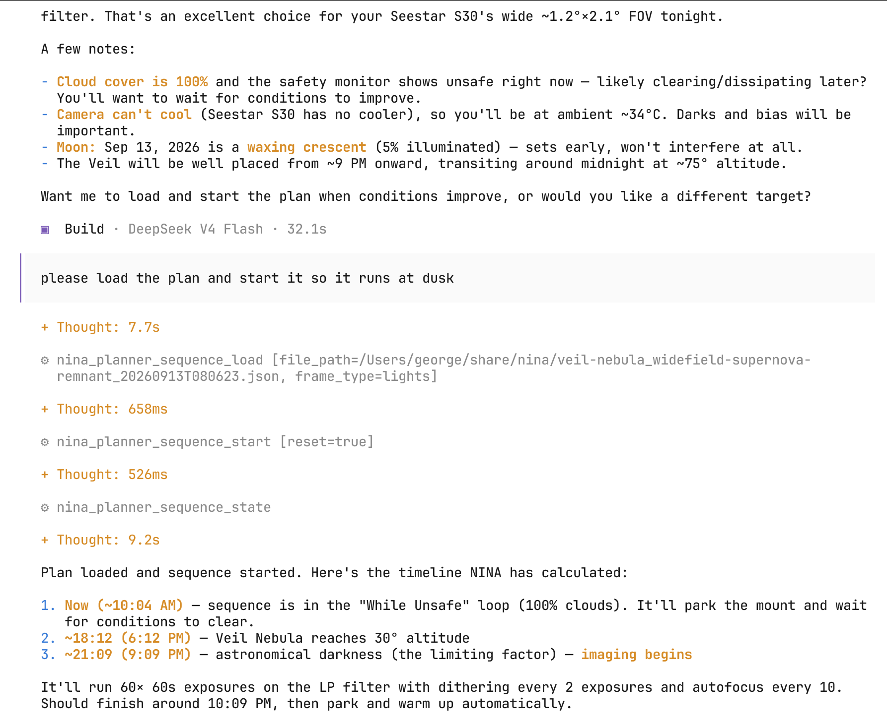

# nina_planner — An Observatory Operator Agent



`nina_planner` is an MCP tool server for N.I.N.A. (Nighttime Imaging 'N' Astronomy). It lets you inspect equipment, write observation plans, load sequences, and control the telescope — all through tool calls in your AI client.  The focus is on tools to generate and manage sequences on N.I.N.A. rather than issuing real-time raw Advanced API commands.  This mcp server can generate "plans", in the style of ACP plans but in json, which then can be loaded and run as Advanced sequences.

---

## Available Tools

### Equipment & Telemetry

| Tool | Purpose |
|---|---|
| `get_site_equipment_status()` | List connected hardware (mount, camera, focuser, guider, safety monitor, weather, dome, filter wheel, rotator). Auto-connects any device that is present but disconnected. |
| `get_site_profile()` | Get observatory location (lat/lon/elevation), optics details, filter list, plate solver type, and image save path. |
| `get_events(since)` | Get latest observatory event log entries from `since` seconds. |
| `get_logs(since)` | Get latest N.I.N.A. application log entries from `since` seconds. |
| `observation_plan_write_file(plan)` | Write out an observation plan JSON file. |

### Sequence Management

| Tool | Purpose |
|---|---|
| `sequence_load_plan(file_path, frame_type)` | Load a plan file as a sequence (lights, darks, bias, dawn_flats, or dusk_flats). |
| `sequence_start()` | Start or resume a stopped sequence. |
| `sequence_stop()` | Stop any running sequence. |
| `sequence_enter_safety_standby()` | Start a non-imaging sequence with safety guardrails. |
| `sequence_execute_teardown(seestar)` | Start a teardown sequence, parking scope. Pass `seestar=True` for a Seestar telescope. |
| `sequence_get_state()` | Get the state of the currently loaded sequence, running or not. |

---

## The Observation Plan

A plan is a JSON document that describes one complete imaging session. It encodes the **target**, **exposure settings** for all five frame types, and **equipment configuration** (cooler, autofocus, guiding, constraints).

### Plan structure

```json
{
  "target": "Veil Nebula",
  "intent": "Widefield supernova remnant",
  "description": "Veil Nebula complex centered between Western NGC 6960 and Eastern NGC 6992",
  "ra_hours": 20.85,
  "dec_deg": 31.22,
  "batch_size": 5,

  "cooler": {
    "on": true,
    "setpoint_celsius": -10.0
  },
  "constraints": {
    "min_altitude": 30.0,
    "horizon_offset_degrees": 2.0
  },
  "autofocus": {
    "reference_filter_name": "LP",
    "hfr_increase_sample_size": 3,
    "hfr_increase_threshold_percent": 15.0,
    "every_n_exposures": 10,
    "threshold_celsius": 1.0
  },
  "guiding": {
    "dither_every_n_exposures": 2,
    "check_drift_every_n_exposures": 6,
    "max_drift_arcmin": 1.5
  },

  "lights": [
    { "filter_name": "LP", "exposure_time_seconds": 60.0, "total_count": 60 }
  ],
  "flats": [
    { "filter_name": "LP", "exposure_time_seconds": 5.0, "total_count": 30 }
  ],
  "darks": [
    { "exposure_time_seconds": 60.0, "total_count": 20 }
  ],
  "bias": [
    { "total_count": 30 }
  ]
}
```

### Fields

| Field | Required | Description |
|---|---|---|
| `target` | no | Catalog designation, e.g. "M31", "NGC 7000" |
| `intent` | no | 2-3 words describing the goal |
| `description` | no | explanation of the observation plan, including rationale, exposure goals, equipment, or sky constraints |
| `ra_hours` | **yes** | J2000 right ascension in hours `[0, 24)` |
| `dec_deg` | **yes** | J2000 declination in degrees `[-90, +90]` |
| `batch_size` | no | Exposures per batch (0 = no batching, default 5) |
| `cooler` | no | Target setpoint (default -10°C) |
| `constraints` | no | Minimum altitude and horizon safety buffer |
| `autofocus` | no | Reference filter, HFR and temperature thresholds, interval |
| `guiding` | no | Dither and drift-recenter settings |
| `lights` | **yes** | Light exposure groups (filter + time + count) |
| `flats` | **yes** | Flat exposure groups (filter + time + count) |
| `darks` | **yes** | Dark exposure groups (time + count) — match light exposure times |
| `bias` | **yes** | Bias frame count (single exposure, no filter needed) |

---

## Workflow: A Complete Imaging Run

### 1. Write the plan

Use `observation_plan_write_file` with the plan object. This validates the filter names against your active N.I.N.A. profile and writes a JSON file named like `veil-nebula_widefield-supernova-remnant_20260913T080623.json`.

### 2. Load and run each calibration type, including lights

Each call to `sequence_load_plan` stops any running sequence, builds the appropriate container (lights, darks, flats, or bias), and posts it to N.I.N.A.

**Example order:**

1. **Load lights** (main imaging overnight):
   `sequence_load_plan(file_path="<plan>.json", frame_type="lights")`
   `sequence_start()`
   _(runs all night; autofocus and guiding triggers are built in)_

2. **Load darks** (done during the day or while flats are not possible):
   `sequence_load_plan(file_path="<plan>.json", frame_type="darks")`
   `sequence_start()`
   _(wait for completion)_

3. **Load bias** (also done during the day):
   `sequence_load_plan(file_path="<plan>.json", frame_type="bias")`
   `sequence_start()`
   _(wait for completion)_

5. **Load dawn flats** (morning twilight):
   `sequence_load_plan(file_path="<plan>.json", frame_type="dawn_flats")`
   `sequence_start()`
   _(wait for completion)_

4. **Load dusk flats** (as evening twilight begins):
   `sequence_load_plan(file_path="<plan>.json", frame_type="dusk_flats")`
   `sequence_start()`
   _(wait for completion)_

### 3. Teardown

At session end:
- The running sequence should teardown automatically at dawn.
- `sequence_execute_teardown` — only needed if want to immediately close for the night or the running sequence fails to park.

---

## Notes

- **Filter validation:** `observation_plan_write_file` and `sequence_load_plan` check that every filter name in the plan (lights, flats, autofocus reference) matches a filter in your active N.I.N.A. profile. Unknown filters will be rejected with an error listing what is available.
- **The plan file is persistent:** — written to the current working directory. You can inspect, edit, and reuse it across sessions.
- **Experimental:** This code is highly experimental.  At the moment I am testing it at my observatory.  However I don't have a camera cooler.  So those operations are untested.  The agent generates an advanced sequence that it loads into N.I.N.A.  This sequence is still in alpha.  

---

## `nina-plugin.ts` — OpenCode Autonomous Plugin

`nina-plugin.ts` is an [opencode](https://opencode.ai) plugin (not compatible with Claude Code or other MCP clients). Once registered in `opencode.json`, it runs as a background server inside opencode and does two things:

1. **Websocket event monitoring** — Connects to the N.I.N.A. event socket (`ws://<host:port>/v2/socket`), subscribes to all events, and forwards them to the active agent as intervention prompts. Events are batched with a 1-second debounce to avoid flooding the conversation.

2. **Interval check** — Every `NINA_INTERVAL_MINUTES` (default 10) it prompts the agent to query observatory status (`sequence_get_state`, `get_site_equipment_status`) and decide what to do next, even when no N.I.N.A. events are firing.

The plugin uses two different active opencode "agents", if they are configured, otherwise it uses the main session model.  One agent is called `event` for responding to incoming N.I.N.A. events over websocket and and the other is `check` for responding to the interval check.

The plugin auto-reconnects on websocket disconnection with a 5-second retry. On server dispose, it cleans up all timers and the socket.

---

## `opencode.json` — Sample Configuration

```jsonc
{
  "$schema": "https://opencode.ai/config.json",
  "plugin": [
    "./nina-plugin.ts"
  ],
  "mcp": {
    "nina_planner": {
      "type": "local",
      "command": [
        "bash",
        "-c",
        "python -m nina_planner 2>> /tmp/opencode_nina_planner.log"
      ]
    }
  }
}
```

Registers the opencode plugin and the `nina_planner` MCP server so both run together. The MCP server provides the tools (`sequence_load_plan`, `get_site_equipment_status`, etc.) that the plugin-prompted agent calls.

---

## Environment Variables

### `nina-plugin.ts` (opencode plugin)

| Variable | Default | Description |
|---|---|---|
| `NINA_ENDPOINT` | `localhost:1888` | N.I.N.A. host and port for the websocket event stream |
| `NINA_INTERVAL_MINUTES` | `10` | Interval between autonomous status checks (float) |

### `nina_planner` (MCP server)

| Variable | Default | Description |
|---|---|---|
| `NINA_ENDPOINT` | `localhost:1888` | N.I.N.A. host and port for the REST API (`host:port`) |
| `NINA_FLATS_ALTITUDE` | `80` | Altitude in degrees for flat panel calibration frames |
| `NINA_FLATS_AZIMUTH_DAWN` | `270` | Azimuth in degrees pointing west for dawn flats |
| `NINA_FLATS_AZIMUTH_DUSK` | `90` | Azimuth in degrees pointing east for dusk flats |

