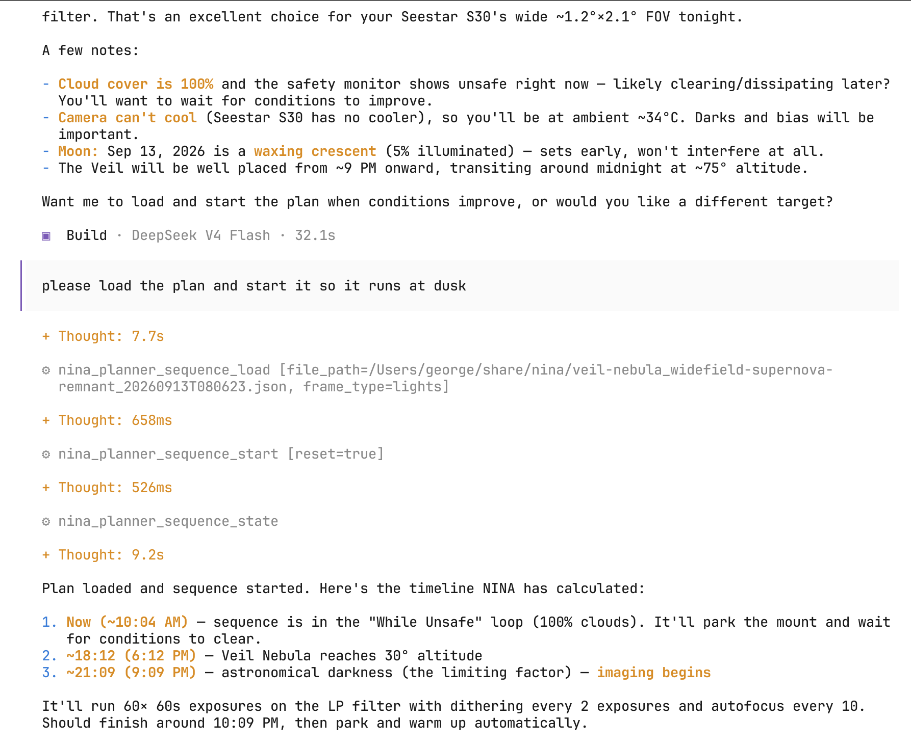

# nina_planner — An Observatory Operator Agent



`nina_planner` is an MCP tool server for N.I.N.A. (Nighttime Imaging 'N' Astronomy). It lets you inspect equipment, write observation plans, load sequences, and control the telescope — all through tool calls in your AI client.  The focus is on tools to generate and manage sequences on N.I.N.A. rather than issuing real-time raw Advanced API commands.  This MCP server can generate "plans" — in the style of ACP (DC-3 Dreams) observatory plans, but as JSON — which can then be loaded and run as N.I.N.A. Advanced sequences.

---

## Available Tools

### Equipment & Telemetry

| Tool | Purpose |
|---|---|
| `get_site_equipment_status()` | Return the current connection state, operating state, measurements, and capabilities of active observatory equipment (mount, camera, focuser, guider, safety monitor, weather, dome, filter wheel, rotator). Auto-connects any device that is present but disconnected; if any device is mid-connect the call will error and the agent should retry after a few seconds. |
| `get_site_profile()` | Get observatory location (lat/lon/elevation), optics details, filter list, plate solver type, and image save path — as the raw Windows `image_save_path` plus the derived `local_image_save_path` resolved for this host (see `NINA_DRIVE_MOUNT`). |
| `list_site_profiles()` | List every NINA observatory profile — each with its id, name, description, and last-used time — marking the currently active one. Use it to discover which profiles exist and to find the id of the one you want. Only the active profile exposes full site/optics/filter detail. |
| `switch_site_profile(profile_id)` | Switch the active NINA profile to the one with the given id (from `list_site_profiles`). The id is passed straight through to NINA, so an unknown id surfaces NINA's own error. Switching disconnects/reconnects equipment and changes site, filters, image-save path, and file pattern, so do not call it while a sequence is running. |
| `get_events(since)` | Get latest observatory event log entries from `since` seconds. |
| `get_logs(since)` | Get latest N.I.N.A. application log entries from `since` seconds. |
| `screenshot_dashboard()` | Capture the N.I.N.A. dashboard as a PNG and return **two content blocks: the absolute file path as text, then the image itself** (e.g. `/var/folders/.../T/nina_screenshots/dashboard_20261005T120000123456.png`) — the image is written to the system temp dir under `nina_screenshots/`, one uniquely named file per call, nothing overwritten. Clients that render MCP image blocks show the capture inline; otherwise open the returned path with the read tool to view it. The tool is unstructured (no `outputSchema`) because it carries mixed text/image content. Switches NINA to the Imaging tab first so the capture shows the main imaging workspace; that tab switch is the only side effect, no sequence or equipment state changes. |
| `get_imaging_metadata(file_path, pointing_index=1, image_type="light")` | Return imaging metadata for an observation-plan JSON file and one of its pointings, for the image type (light, dark, bias, flat — case-insensitive) as a wide table with one row per exposure. Light frames are attributed via the `{base_plan_id}-{pointing_index}` id embedded in the recorded file path; dark/bias/flat frames are matched by image type/filter/exposure and are anchored to the plan's light session: they count only when shot within `calibration_window_days` of the session start (the earliest attributed light), on either side of it. Each row carries the frame identity fields (`file_path`, `exposure_number`, `exposure_start`, `duration`, `filter_name`) plus its metrics as columns, namespaced by group (`quality.hfr`, `guiding.rms`, `background.adu_mean`, `pointing.airmass`, ...). Timestamps are normalized to milliseconds-precision UTC ISO-8601 with a `Z` suffix (e.g. `2026-09-22T02:16:25.123Z`). Per-exposure weather samples from `WeatherData.csv` are joined onto the same row (`weather.temperature`, `humidity`, `cloud_cover`, ...) by exposure number and normalized UTC exposure start. Dead columns are dropped dynamically: columns constant across the returned frames are listed once under `summary.constants`; columns with no real values (ASCOM NaN/-1, empty, `n/a`, and the `0` sentinel N.I.N.A writes for unmeasured quality/guiding/CCD metrics) are listed under `summary.unpopulated`. The result also carries the plan's `plan_id`, `pointing_index`, and `target`. |
| `write_plan_file(plan)` | Write out an observation plan JSON file. |
| `write_mosaic_plan(plan_path, mosaic_csv, output_path?)` | Expand a base plan into a multi-pointing mosaic plan from a Telescopius-formatted mosaic CSV (one pointing per pane). Replaces the base plan's pointings, clears its `plan_id` so the mosaic gets its own content-derived id, and writes `<target>_<intent>_mosaic_<timestamp>.json` (or `output_path`). Pane `row`/`column` are stored as metadata; N.I.N.A. does not consume them. With no rotator, every pane's `position_angle_deg` must be `0`. |
| `get_plan_progress(file_path, max_hfr?, min_detected_stars?, max_guiding_rms_arcsec?)` | Report per-frame-type progress for every pointing: total, acquired (attributed to `{base_plan_id}-{pointing_index}`), and remaining for each exposure group, plus a top-level `complete` (all panes done) and a per-pane `pointings` list with per-pane `complete`. Quality thresholds exclude light frames that fail them. Calibration groups (flat/dark/bias) also carry `window_open` (bool) and `window_end` (naive ISO timestamp of `earliest light + calibration_window_days` on N.I.N.A.'s local clock): while the current time is inside that window `remaining_count` is `total − acquired`; once it falls outside, no frame shot now could ever be credited, so `remaining_count` is `0` (with `window_open: false`) instead of an unsatisfiable deficit — `acquired_count` stays truthful, and lights carry neither field. Raise `calibration_window_days` or write a new plan to reopen the window. Panes can be acquired sequentially from the result. |

### Sequence Management

| Tool | Purpose |
|---|---|
| `load_sequence(request=[{plan?, action="light", pointing_index=1, mode="remaining", max_hfr?, min_detected_stars?, max_guiding_rms_arcsec?}, ...])` | Load a plan file as a sequence **without starting it** — call `start_sequence()` to begin. `request` is a **list** of request objects (the only form; it defaults to an empty list = the stow, last row) composing one N.I.N.A. sequence. In each entry, `plan` is the observation-plan JSON path and `action` (light, dark, bias, dawn_flat, or dusk_flat) says which sequence to build from it. `plan` is optional in the schema, but every action builds its sequence from a plan, so omitting it raises an error naming the entry (`request[0]: action='light' requires a plan`). `pointing_index` (1-based, default 1) selects which pointing of the plan to load — lights embed `{base_plan_id}-{pointing_index}` in the NINA target name so each pointing's frames are attributed independently. Default `remaining` mode acquires only frames not yet attributed to that pointing; `mode="full"` acquires the whole plan. Quality thresholds exclude light frames that fail them from the acquired count. Reports "pointing complete" and loads nothing when nothing remains. Refuses to load while a sequence is already running — call `stop_sequence()` first. |
| `start_sequence()` | Start the currently loaded sequence. |
| `stop_sequence()` | Stop any running sequence and wait until NINA reports it has actually stopped. |
| `load_sequence(request=[{...}, {...}, ...])` | A **list** of request objects (the only form) composes one N.I.N.A. sequence for the whole night: a single Start area, one Target area holding each step's containers in list order, and a single End area that always stows (park, then warm), so the night ends parked and warm no matter what ran. **An empty list is therefore the stow**: an empty Target area plus that closing End area — one bounded 3-minute "On Safe" wait, then park (or home) the mount and warm the camera. Every action is plan-backed; there is no `stow`/`park`/`warm`/`unpark` action, and `load_sequence()` with no arguments is the teardown. Steps run in order as the sequence reaches them: a step with its own waits (lights, flats) waits, or is skipped once its window has passed, without blocking the steps behind it. Entries already complete in `remaining` mode are skipped and reported; if every entry is complete nothing is sent to N.I.N.A. Profile, equipment, and metadata are fetched once, a single POST carries the whole sequence, and a validation error names the offending entry by its 0-based position (`request[1]: ...`). Load it, then one `start_sequence()` runs the night. |
| `get_sequence_state()` | Return the loaded sequence structure and the current status of its containers, instructions, conditions, and triggers (whether loaded, running, completed, failed, or waiting). |
| `stop_nina()` | Terminate the NINA.exe application immediately via taskkill. Liveness comes from the REST API: it no-ops when NINA is already down, and errors when NINA is up but remote (no local Windows interop) since it cannot be terminated from here. |
| `start_nina(time=None)` | Launch NINA into the active interactive desktop session (GUI visible). With `time=None`, launches on current real time. With `time="YYYY-MM-DDTHH:MM:SS"`, shifts host clock, launches NINA, and restores real clock so NINA runs on simulated time. Errors if NINA is already running (call `stop_nina()` first), and errors when this host has no Windows interop to launch a remote NINA. |
| `get_nina_status()` | REST-API-authoritative liveness probe: `running` (true iff `GET /time` answered), `lifecycle_control_available` (whether this host can start/stop NINA via Windows interop), the NINA/host clock fields, and a one-line summary. Never raises on a down NINA. |
| `get_nina_time()` | Report NINA's clock versus host clock, delta in seconds, and whether NINA is on simulated time. |

---

## The Observation Plan

A plan is a JSON document that describes one complete imaging session. It encodes the **target**, **exposure settings** for all five frame types, and **equipment configuration** (cooler, autofocus, guiding, constraints).

### Plan structure

An example json plan:

[veil-nebula_widefield-supernova-remnant_20260913T080623.json](./veil-nebula_widefield-supernova-remnant_20260913T080623.json)
```json veil-nebula_widefield-supernova-remnant_20260913T080623.json
{
  "target": "Veil Nebula",
  "intent": "Widefield supernova remnant",
  "description": "Veil Nebula complex centered between Western NGC 6960 and Eastern NGC 6992",
  "pointings": [
    {
      "ra_hours": 20.85,
      "dec_deg": 31.22
    }
  ],
  "batch_size": 5,
  "cooler": {
    "on": true,
    "setpoint_celsius": -10.0
  },
  "constraints": {
    "min_altitude": 30.0,
    "horizon_offset_degrees": 2.0
  },
  "autofocus": {
    "reference_filter_name": "LP",
    "hfr_increase_sample_size": 3,
    "hfr_increase_threshold_percent": 15.0,
    "every_n_exposures": 10,
    "threshold_celsius": 1.0
  },
  "guiding": {
    "dither_every_n_exposures": 2,
    "check_drift_every_n_exposures": 6,
    "max_drift_arcmin": 1.5
  },
  "light_frames": [
    {
      "filter_name": "LP",
      "exposure_time_seconds": 60.0,
      "total_count": 60
    }
  ],
  "flat_frames": [
    {
      "filter_name": "LP",
      "exposure_time_seconds": 5.0,
      "total_count": 30
    }
  ],
  "dark_frames": [
    {
      "exposure_time_seconds": 60.0,
      "total_count": 20
    }
  ],
  "bias_frames": [
    {
      "total_count": 30
    }
  ]
}
``` 

### Fields

| Field | Required | Description |
|---|---|---|
| `target` | no | Catalog designation, e.g. "M31", "NGC 7000" |
| `intent` | no | 2-3 words describing the goal |
| `plan_id` | no | Stable identifier stamped on write. Used for frame attribution; when absent, a deterministic hash of plan content is used. |
| `description` | no | explanation of the observation plan, including rationale, exposure goals, equipment, or sky constraints |
| `pointings` | **yes** | One or more target pointings. Each is a `Pointing` object: `label` (optional string shown in the NINA target name when set), `ra_hours` (J2000 RA in hours, `[0, 24)`), `dec_deg` (J2000 dec in degrees, `[-90, +90]`), `position_angle_deg` (optional rotator PA in degrees east of north, 

`[mosaic.csv](./mosaic.csv)
```csv mosaic.csv
Pane, RA, DEC, Position Angle (East), Pane width (arcmins), Pane height (arcmins), Overlap, Row, Column
Pane 1, 0hr 56' 01", 45º 51' 18", 0.00, 309.00, 205.80, 10%, 1, 1
Pane 2, 0hr 29' 28", 45º 51' 18", 0.00, 309.00, 205.80, 10%, 1, 2
Pane 3, 0hr 55' 22", 42º 46' 13", 0.00, 309.00, 205.80, 10%, 2, 1
Pane 4, 0hr 30' 07", 42º 46' 13", 0.00, 309.00, 205.80, 10%, 2, 2
Pane 5, 0hr 54' 47", 39º 41' 07", 0.00, 309.00, 205.80, 10%, 3, 1
Pane 6, 0hr 30' 42", 39º 41' 07", 0.00, 309.00, 205.80, 10%, 3, 2
Pane 7, 0hr 54' 15", 36º 36' 00", 0.00, 309.00, 205.80, 10%, 4, 1
Pane 8, 0hr 31' 14", 36º 36' 00", 0.00, 309.00, 205.80, 10%, 4, 2
```

Each row becomes a `Pointing`: RA/DEC are parsed server-side (sexagesimal like `0hr 56' 01"` / `45º 51' 18"` or decimal), `Pane` becomes the `label`, and `Row`/`Column` are stored as `row`/`column` metadata (N.I.N.A. does not use them — they are kept for ordering, labeling, and later mosaic assembly). The base plan's `plan_id` is cleared so the mosaic gets its own content-derived id; each pane is attributed independently via `({plan_id}-{pointing_index})`.

- **No rotator:** every pane's `position_angle_deg` must be `0`. Any nonzero PA fails loudly, since PA can't be enforced without a rotator.
- **Acquiring panes:** query `get_plan_progress(file_path)` to see which panes still need frames, then load the first incomplete pane with `load_sequence(request=[{"plan": file_path, "action": "light", "pointing_index": N, "mode": "remaining"}])` and `start_sequence()`. Repeat pane by pane across the night; when the top-level `complete` is true, the mosaic is done.

---

## Workflow: A Complete Imaging Run

### 1. Write the plan

Use `write_plan_file` with the plan object. This validates the filter names against your active N.I.N.A. profile and writes a JSON file named like `veil-nebula_widefield-supernova-remnant_20260913T080623.json`.

### 2. Load and run each calibration type, including lights

Each call to `load_sequence` composes the appropriate steps (lights, darks, flats, or bias) into one N.I.N.A. sequence and posts it — it only loads the sequence; it never starts it. Every step below is therefore two calls: `load_sequence(...)`, then `start_sequence()` when you are ready to begin (or press start in the NINA GUI yourself). N.I.N.A. rejects a load while a sequence is running, so stop any running sequence first with `stop_sequence()` (which blocks until it has actually stopped); `load_sequence` returns a clear error telling you to do so otherwise.

**Or hand N.I.N.A. the whole night in one call:** pass the whole night as one **list** of request objects:

`load_sequence(request=[{"plan": "<plan>.json", "action": "light", "pointing_index": 1}, {"plan": "<plan>.json", "action": "light", "pointing_index": 2}, {"plan": "<plan>.json", "action": "dark"}])` then a single `start_sequence()`

The steps run in list order inside one sequence (one Start area, one Target area, one End area), one POST carries the lot, and entries already complete in `remaining` mode are skipped and reported. The End area always stows (park + warm) — so the night ends parked and warm no matter what ran, and an empty list with no steps at all is exactly the stow. Each step keeps its own conditions: a step whose window has passed (dawn flats after sunrise) is skipped instead of blocking the steps behind it.

**Example order:**

1. **Run lights** (main imaging overnight):
   `load_sequence(request=[{"plan": "<plan>.json", "action": "light"}])` then `start_sequence()`
   _(runs all night; autofocus and guiding triggers are built in)_

2. **Run darks** (done during the day or while flats are not possible):
   `load_sequence(request=[{"plan": "<plan>.json", "action": "dark"}])` then `start_sequence()`
   _(wait for completion)_

3. **Run bias** (also done during the day):
   `load_sequence(request=[{"plan": "<plan>.json", "action": "bias"}])` then `start_sequence()`
   _(wait for completion)_

4. **Run dawn flats** (morning twilight):
   `load_sequence(request=[{"plan": "<plan>.json", "action": "dawn_flat"}])` then `start_sequence()`
   _(wait for completion)_

5. **Run dusk flats** (as evening twilight begins):
   `load_sequence(request=[{"plan": "<plan>.json", "action": "dusk_flat"}])` then `start_sequence()`
   _(wait for completion)_

### 3. Teardown

At session end:
- The running sequence should teardown automatically at dawn.
- `load_sequence()` then `start_sequence()` — the empty list is the stow; only needed if want to immediately close for the night or the running sequence fails to park. Every action is plan-backed, so an empty list is the only teardown form.

---

## Notes

- **Required N.I.N.A. plugins:** the MCP server requires the following three plugins to be installed in N.I.N.A.: **Advanced API**, **Sequencer+**, and **Session Metadata**.
- **Image file pattern:** in the N.I.N.A. profile's `ImageFileSettings`, `FilePattern` must put `$$IMAGETYPE$$` in a path segment (e.g. `$$DATEMINUS12$$\$$IMAGETYPE$$\...`) so frames can be read per type, and — for light attribution — must include `$$TARGETNAME$$` (see below). The `$$DATEMINUS12$$` date folder is no longer required: calibration age is measured from each frame's own `ExposureStart` timestamp, not the folder name.
- **Filter validation:** `write_plan_file` and `load_sequence` check that every filter name in the plan (lights, flats, autofocus reference) matches a filter in your active N.I.N.A. profile. Unknown filters will be rejected with an error listing what is available.
- **Frame attribution:** each light sequence names its target `<target>` (or `<target> - <label>` when the pointing has a label), followed by ` ({base_plan_id}-{pointing_index})`, and N.I.N.A. expands `$$TARGETNAME$$` in `FilePattern` to that string. For the embedded id to be usable for attribution, `$$TARGETNAME$$` **must appear somewhere in the file pattern** — either as a filename token (e.g. `..._$$TARGETNAME$$_...`) or as a folder segment (e.g. `$$DATEMINUS12$$\$$IMAGETYPE$$\$$TARGETNAME$$\...`). Attribution reads the embedded id from the recorded file path (`file_path` in `ImageMetaData.csv`) and accepts it in **any** path segment — the filename, the target directory under `$$IMAGETYPE$$`, or an ancestor directory when `$$TARGETNAME$$` leads the pattern (e.g. `$$TARGETNAME$$\$$DATEMINUS12$$\$$IMAGETYPE$$\...`). The token is unique to a plan pointing, so ancestor matching cannot cross-attribute between plans; if the target name is not embedded in the path at all, attribution cannot determine which plan/pointing a light frame belongs to. Parentheses are used because N.I.N.A. mangles square brackets in target names; only the parenthesised token is recognised, so frames acquired under the earlier `[{base_plan_id}-{pointing_index}]` form are not attributed. The sequence also records the target in `TargetName` in `AcquisitionDetails.csv` and as `OBJECT` in FITS headers, but those are informational — file-path attribution is what drives `get_plan_progress` and `mode="remaining"`.
- **Resuming a pointing:** call `get_plan_progress(file_path, ...)` and read the entry for pointing `N` in the returned `pointings` list to see what it has already acquired, then `load_sequence(request=[{"plan": <plan_path>, "action": "light", "pointing_index": N, "mode": "remaining"}])` to acquire only the deficit. Lights are attributed by the `{base_plan_id}-{pointing_index}` id embedded in the file path (so `$$TARGETNAME$$` must be in the file pattern — see above). Different pointings of the same plan file are attributed independently because their embedded ids differ. Flats, darks, and bias are matched by image type/filter/exposure **and** are anchored to the plan's light session: they count only when shot within `calibration_window_days` (default 7) of the earliest attributed light, on either side of it. Calibration acquired inside that window stays counted, so it is not re-shot on every later run. While the current time is still inside the window the deficit is reported (and `window_open` is `true`); once the current time falls outside it, `remaining_count` reads 0 with `window_open: false` and `load_sequence(request=[{"plan": <plan_path>, "action": "dark", "mode": "remaining"}])` loads nothing — raise `calibration_window_days` or write a new plan to reopen the window. Pass `mode="full"` to deliberately re-acquire. For a mosaic, `get_plan_progress(file_path)` summarizes every pane at once — see [Mosaics](#mosaics).
- **Quality thresholds:** `max_hfr` and `min_detected_stars` (optional) exclude light frames that fail the thresholds from the acquired count. Frames missing the quality fields are excluded whenever a threshold is set (fail-closed). Thresholds are applied only to light frames — calibration frames have no star quality.
- **Manually failing a frame:** delete (or move) the image file on disk — e.g. a bad `.fits`/`.tif`. The metadata row stays in the CSV (the plugin only appends), but it is omitted when the metadata is read, so progress no longer counts that frame as acquired and the next `mode="remaining"` load re-acquires it.
- **The plan file is persistent** — written to the current working directory. You can inspect, edit, and reuse it across sessions.
- **Experimental:** This code is highly experimental.  At the moment I am testing it at my observatory.  However I don't have a camera cooler.  So those operations are untested.  The agent generates an advanced sequence that it loads into N.I.N.A.  This sequence is still in alpha.  

---

## `nina-plugin.ts` — OpenCode v2 Autonomous Plugin

`nina-plugin.ts` is an [opencode](https://opencode.ai) v2 plugin (not compatible with Claude Code or other MCP clients). Once registered in `opencode.json`, it runs as a background server inside opencode and does two things:

1. **Websocket event monitoring** — Connects to the N.I.N.A. event socket (`ws://<host:port>/v2/socket`), subscribes to all events, and forwards them to the active agent as intervention prompts. Events are batched with a 1-second debounce to avoid flooding the conversation.

2. **Interval check** — Every `NINA_INTERVAL_MINUTES` (default 10) it prompts the agent to query observatory status (`get_sequence_state`, `get_site_equipment_status`) and decide what to do next, even when no N.I.N.A. events are firing.

The plugin triggers a dedicated opencode "agent" called `worker` (see [`worker.md`](#workermd--opencode-worker-agent)), if it is configured, otherwise it uses the main session model. Both websocket-event triggers and interval checks prompt the same `worker` agent in an isolated session, which checks observatory status and takes action.

The plugin auto-reconnects on websocket disconnection with a 5-second retry. On server dispose, it cleans up all timers and the socket.

---

## `AGENTS.md` — OpenCode Worker Agent

`AGENTS.md` (in `.opencode/agents/`) defines the observer agent that the active console user becomes and the `nina-plugin.ts` triggers for automated safety interrupts, sequence halts, and recovery routines.

---

### `PLAN.md` — the living wishlist

A markdown file at the project root, **edited by the user at any time** (before or during the night). It is intentionally lightweight — entries can be as simple as a target name:

1. **Metadata** — night date, overall intent (optional).
2. **Candidate targets** — each with:
   - name / catalog designation (minimum required — everything else optional)
   - optional: coordinates, filter + exposure + count (if you want specifics)
   - optional: reference to an existing plan JSON file, or let the worker generate one
   - priority (1 = highest, optional)
   - optional time window / note
3. **Selection rules** — how the worker picks among candidates:
   - altitude floor (default e.g. 30°)
   - horizon buffer
   - tie-break order (priority, then highest current altitude, then earliest available)

Example shapes (illustrative — both are valid):

[PLAN.md](./PLAN.md)
```json PLAN.md
# Tonight

- M31          "before the moon comes up"
- Veil Nebula  plan=veil-nebula_..._20260913.json   prio 1
- M33          "if high targets done"

Rules:
- min_altitude: 30
- horizon_offset_degrees: 2
- tie_break: priority, then altitude
```

### How the night runs

- The worker evaluates each un-imaged candidate, computes its current altitude (or loads its plan sequence and lets N.I.N.A. report it), and picks the best target: highest priority, then highest current altitude, then earliest available. It never interrupts a running observation — re-selection only happens after a sequence finishes.
- For the chosen target, the worker loads the referenced plan JSON if given, otherwise generates one via `write_plan_file` (using coords/filter/count from `PLAN.md`, or sensible defaults), then `load_sequence(request=[{"plan": <plan_path>, "action": "light"}])` followed by `start_sequence()`.
- When no candidate is viable (all below the altitude floor, or the night is over), the worker writes `report.md` (overwriting any previous one) with the night's results, stows the scope, and stops. Editing `PLAN.md` later triggers re-evaluation.
- You can add/remove/reorder lines at any moment. The worker records completion in `PROGRESS.md` instead and leaves `PLAN.md` untouched, so your editing isn't fought over.

---

## `PROGRESS.md` — Shared Progress File

`PROGRESS.md` is a shared observatory progress file in the project directory. Both the active session and the automated `worker` sessions read it on start to restore context before acting, and append a short ISO-8601-timestamped entry after each significant action (status checks, plan writes, sequence loads/starts/stops, errors, and interventions), recording what was done, the observed equipment and safety state, and any decisions. This keeps history shared across sessions.

---

## `opencode.json` — Opencode v2 Sample Configuration

[.opencode/opencode.json](./.opencode/opencode.json)
```json .opencode/opencode.json
{
  "$schema": "https://opencode.ai/config.json",
  "model": "opencode-go/mimo-v2.6-flash",
  "plugins": [
    {
      "package": "./local/plugins/nina_notify",
      "options": {
        "pluginLogs": "C:/Windows/Temp/nina-notify-debug.log"
      }
    }
  ],
  "mcp": {
    "nina-planner": {
      "type": "local",
      "environment": {
        "NINA_PLANNER_LOG": "C:/Windows/Temp/nina-planner-debug.log"
      },
      "command": [
        "uv", "--directory", ".opencode/local/mcps/nina_planner", "run", "-m", "nina_planner"
      ]
    }
  }
}
```

Registers the opencode plugin and the `nina_planner` MCP server so both run together. The MCP server provides the tools (`load_sequence`, `get_site_equipment_status`, etc.) that the plugin-prompted agent calls.

---

## Plugin Options

### `nina-plugin.ts` (opencode v2 plugin)

Configured under `opencode.json > plugin` as the second array element (see [`opencode.json`](#opencodejson--opencode-v2-sample-configuration)).

| Option | Type | Default | Description |
|---|---|---|---|
| `ninaEndpoint` | string | `127.0.0.1:1888` | N.I.N.A. host and port (no scheme) for the websocket event stream, e.g. `192.168.0.24:1888`. The plugin connects to `ws://<ninaEndpoint>/v2/socket`. |
| `intervalCheck` | number | `-1` | Minutes between autonomous status-check triggers of the `worker` agent. Accepts a float; the value is multiplied by `60_000` ms before scheduling.  Disabled if 0 or less. |
| `pluginLogs` | string | _(none)_ | File path appended on each plugin event (websocket open/message/close/error, batched flush, interval trigger failures). Set to a writable path (e.g. `/tmp/nina-plugins.log`) to capture diagnostic output. Omit or leave empty to disable file logging. |
| `agentHistory` | string | _(none)_ | File path that receives an append-only JSON-lines record of every `worker` session the plugin spawns. Each line is `{ timestamp, sessionId, agent, messages }`. Omit or leave empty to skip history capture. |

---

## Environment Variables

### `nina_planner` (MCP server)

| Variable | Default | Description |
|---|---|---|
| `NINA_ENDPOINT` | `127.0.0.1:1888` | N.I.N.A. host and port for the REST API (`host:port`).  For WSL, try `192.168.0.24:1888`. When this points at a remote host (not the MCP server's own machine), `get_nina_status().lifecycle_control_available` is false and `start_nina`/`stop_nina` cannot operate on NINA. |
| `NINA_DRIVE_MOUNT` | — | Local mount root for the drive letter in the profile's `image_save_path`, used by `get_imaging_metadata` to resolve the imaging directory on Linux and WSL (e.g. `/mnt` on a Mac with C: mounted there, `/mnt/c` in WSL). Defaults to `/mnt/<drive>` (e.g. `/mnt/c`). On Windows (`win32`) the profile `image_save_path` is used directly. The resolved value is also exposed as the derived `local_image_save_path` field on the profile returned by `get_site_profile`. |
| `NINA_FLATS_ALTITUDE` | `80` | Altitude in degrees for flat panel calibration frames |
| `NINA_FLATS_AZIMUTH_DAWN` | `270` | Azimuth in degrees pointing west for dawn flats |
| `NINA_FLATS_AZIMUTH_DUSK` | `90` | Azimuth in degrees pointing east for dusk flats |
| `NINA_EXE_PATH` | `C:\Program Files\N.I.N.A. - Nighttime Imaging 'N' Astronomy\NINA.exe` | Windows path to `NINA.exe` used by `start_nina` to launch NINA. |

## Setting up WSL

Make sure you have setup mirroring to allow you to connect to NINA via localhost.  Do this by editing wslconfig and setting networking mode to mirrored.  Otherwise you will have to know the external ip of your machine in order to connect to your NINA API endpoint.


```
$ vi $HOME/.wslconfig
[wsl2]
networkingMode=mirrored
```

Then shutdown wsl and restart

[$ wsl --shutdown](./$ wsl --shutdown)
```bash
$ wsl --shutdown
<Error: File '$ wsl --shutdown' not found on disk>
```

In addition, to get the system tools to work to stop and restart NINA should it stop, make sudo password less with:


```bash
$ echo "$USER ALL=(ALL) NOPASSWD: ALL" | sudo tee /etc/sudoers.d/90-user
```

## Elevation & the "Change the system time" privilege

`start_nina(time=...)` shifts the Windows host clock with `Set-Date` and restores it after NINA captures the simulated time. Both calls need the **"Change the system time"** privilege (`SeSystemtimePrivilege`) in the Windows token that the MCP server uses.

WSL runs Windows tools under your *Windows login token*, so whether the call succeeds without prompting depends on that token — not on adding admin anywhere.

Check your token from WSL (use the full path — the bare `whoami.exe` is shadowed by the GNU `whoami` in some WSL setups and silently ignores `/priv`):

[/mnt/c/Windows/System32/whoami.exe /priv  | grep -i systemtime](/mnt/c/Windows/System32/whoami.exe /priv  | grep -i systemtime)
```bash
/mnt/c/Windows/System32/whoami.exe /priv  | grep -i systemtime
<Error: File '/mnt/c/Windows/System32/whoami.exe /priv  | grep -i systemtime' not found on disk>
```

If you see `SeSystemtimePrivilege … Enabled` and `High Mandatory Level`, the clock change runs **promptless** — no admin changes needed. The tool calls `Set-Date` directly.

If the privilege is absent or integrity is `Medium`, the tool will fail with a `"shift to '<time>' failed (host may lack 'Change the system time' privilege)"` error. To fix:

1. Grant the user right: `secpol.msc → Local Policies → User Rights Assignment → Change the system time → Add <your account>`. (Add the account itself, not just `Administrators` — the right is stripped from a filtered Medium token.)
2. Re-login so the new privilege appears in your token: `wsl --shutdown`, then reconnect your SSH session.
3. Re-verify: `/mnt/c/Windows/System32/whoami.exe /priv | grep -i systemtime` should now list `SeSystemtimePrivilege … Enabled`.

`start_nina(time=...)` also performs **deterministic restore**: it captures the real host clock before the shift (`real0`) and restores to `real0 + elapsed` after NINA captures the simulated time. No `w32tm /resync` or NTP source is required.
